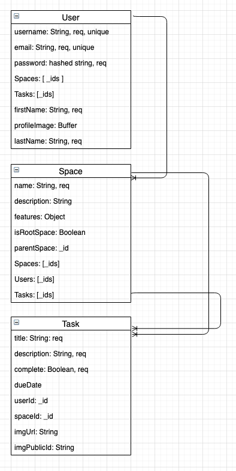

# Project One -- HoneyDew

## Overview
<a href="https://ga-honeydew-tasks.azurewebsites.net/">Visit HoneyDew</a><br/>
HoneyDew is a platform for creating and editing a virtual representation of one's home and the associated tasks. When the user registers, a default space named "Home" is created. While logged in, the user can add any number of spaces or subspaces and assign tasks to them. These tasks can be completed, have images added to them, reassigned to separate spaces, or otherwise deleted. 
The user can also customize their profile page and add an image.

---

## User Stories
As a user, HoneyDew helps me break my to-do list down by the space within the home that each item is tied to. I can have overarching tasks that are applied to the home in general (like doing my taxes or taking out the garbage), or specific tasks that belong to a given space or even subspace (I need to paint a wall in the living room, or I need to update the light fixture in the pantry). This allows me to organize my tasks easily and logically by the space I'm in. 

---

## Stretch Goals

As we expand on the website, we would like to add the ability to see other users and their spaces, and add a "features" property to spaces. Furthermore, we would give the site a social element, allowing users to communicate and add comments to other spaces. Another goal would be to expand the user's ability to customize their experience, adding color schemes such as dark mode or monochrome.


## Technologies, Dependencies
The app is built using a MEN stack (MongoDB, Express, and Node.js) and has the following dependencies: 

```js
- bcryptjs
- body-parser
- cloudinary
- connect-mongo
- datauri
- dotenv
- ejs
- express
- express-session
- express-validator
- method-override 
- mongoose 
- multer
```

## Data Model

The core of the model is made up of 3 objects: **Users**, which can contain many **Spaces**, which themselves can contain many **Tasks**. Spaces can be either free floating or organized into a parent-child relationship within a User. 

